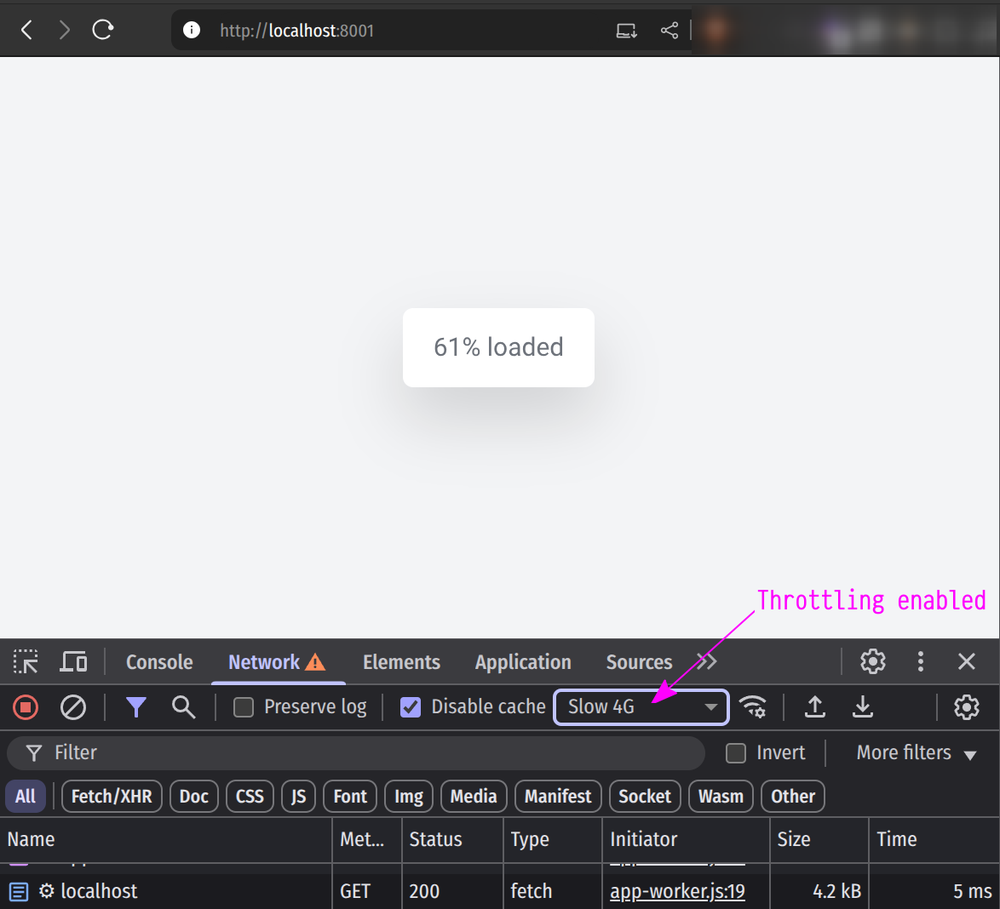

## Loading sample (PWA & Service)

This is a sample app that showcases how the loading screen can be customized in a [go-app](https://go-app.dev) based application.

 

## Prerequisites

-   [entr](https://eradman.com/entrproject/) - used for triggering the recompile and restart of the app on code changes.

-   [node](https://nodejs.org/en/download/) - used for running the TailwindCSS compiler (using `npx` in `run_css.sh`). 
    It regenerates the `web/styles/main.css` file on detected TailwindCSS related rules.

 

## Start

1. Start the TailwindCSS compiler using `./run_css.sh`
1. Start the service using `./run_svc.sh`

These steps are for running the app in "development mode", meaning that it gets restarted on code changes.

Go to http://localhost:8001 to access the Web UI.

 

## The result

If you enable throttling in your browser, you'll see the loading screen as illustrated below.

